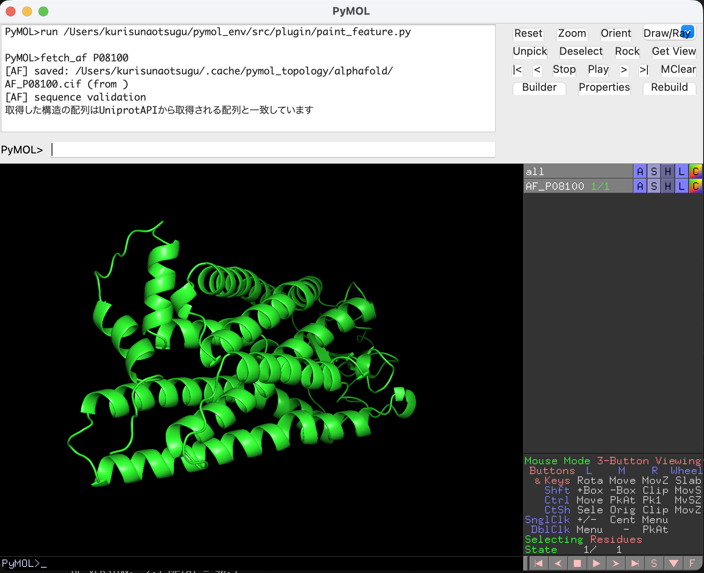
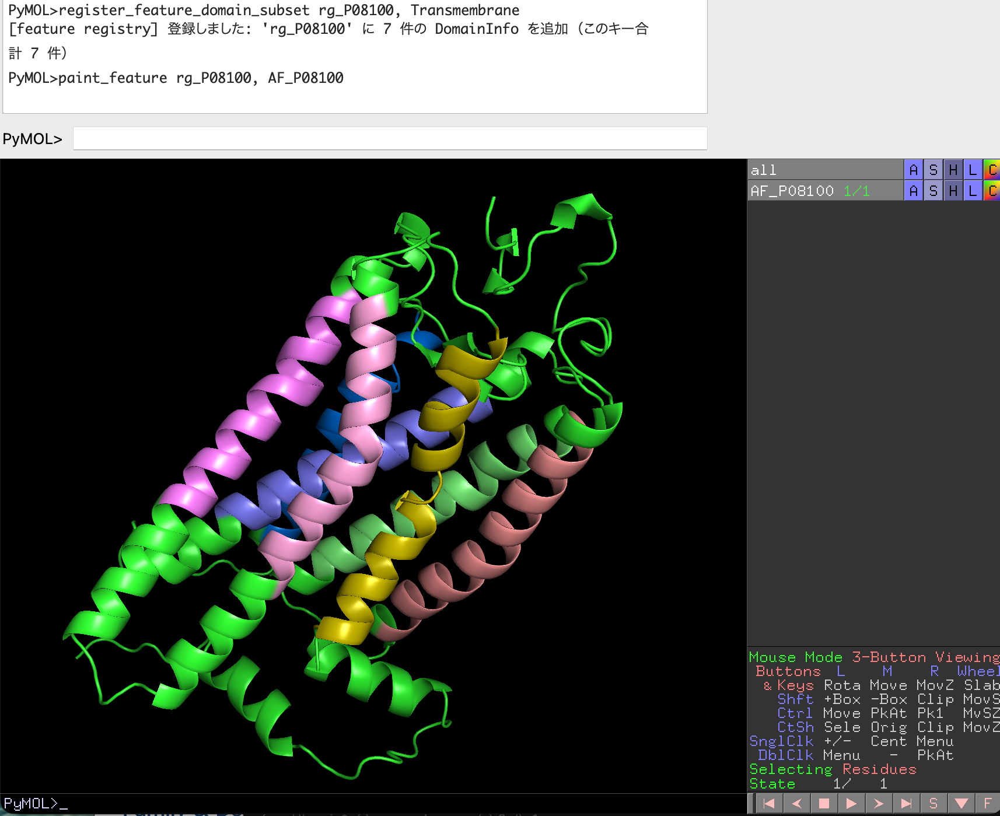

# (pymol plugin) pymol_feature_painter

## 目次

- [プロジェクト概要](#プロジェクト概要)
- [主な機能](#主な機能)
  - [1. 3D構造データのロード (Alphahold DB API)](#1-3d構造データのロード-alphahold-db-api)
  - [2. 指定領域の着色](#2-指定領域の着色)
  - [3. 補助機能](#3--補助機能)
- [想定用途](#想定用途)
- [セットアップ](#セットアップ)
  - [1. 実行環境](#1-実行環境)
  - [2. PYTHONPATHの設定](#2-pythonpathの設定)
  - [3. .pymolrcのセットアップ](#3-pymolrcのセットアップ)
- [リポジトリ構成](#リポジトリ構成)
- [設計思想](#設計思想)
- [使い方](#使い方)
  - [1. PyMOL の起動とプラグインのインポート](#1-pymol-の起動とプラグインのインポート)
    - [1. プロジェクトのルートディレクトリに移動](#1-プロジェクトのルートディレクトリに移動)
    - [2. 仮想環境をアクチベート (`conda activate` or `poetry shell`)](#2-仮想環境をアクチベート-conda-activate-or-poetry-shell)
    - [3. pymol 起動](#3-pymol-起動)
  - [2. AlphaFold 構造を取得してロード](#2-alphafold-構造を取得してロード)
  - [2. UniProt からfeature 情報を登録](#2-uniprot-からfeature-情報を登録)
  - [3. 着色する feature を pymol に登録](#3-着色する-feature-を-pymol-に登録)
  - [3. csvファイルから feature 情報を登録](#3-csvファイルから-feature-情報を登録)
  - [4. 3D構造データの着色](#4-3d構造データの着色)
  - [5. 登録済みの feature 情報の閲覧](#5-登録済みの-feature-情報の閲覧)
  - [6. 登録済みの feature の指定領域の閲覧](#6-登録済みの-feature-の指定領域の閲覧)
- [ライセンス](#ライセンス)

## プロジェクト概要

　本プロジェクトはオープンソースの分子構造グラフィクツールであるpymolのプラグインとして開発され、pymol上に表示されているタンパク質3Dモデルに対して、指定領域ごとの着色を施す機能を付与します。また、領域指定はcsvファイルによる指定およびUniprot APIから取得した feature 情報から指定することが可能です。3D構造データは AlphaFold DB から uniprotアクセッション番号をキーとして自動的にロードすることも可能です。

Uniprotのトポロジー情報に基づいて着色されたタンパク質構造

## 主な機能

### 1. 3D構造データのロード (Alphahold DB API)

- Alphahold DB API () からuniprot開くセッション番号をキーにして構造データ取得
- pymol上に描画する

### 2. 指定領域の着色

- 指定したフォーマットのCSVファイルの情報に従って、構造データの指定領域を着色
- Uniprotアクセッション番号をキーに Uniprot から feature 情報 (二次構造情報やドメイン情報) を取得
- 指定した feature 情報の領域情報に従って構造データの指定領域を着色

### 3.  補助機能

- Alphafold DB API および Uniprot から取得した feature 情報に含まれれるアミノ酸配列の整合確認機能 (配列不一致による領域指定のズレ防止)
- 登録した feature 情報には固有の色が与えられて描写される (auto color fill)

## 想定用途

- PyMOL で AlphaFold DB の構造を素早く可視化したい
- 膜貫通領域や細胞外ドメインなどのトポロジー情報を可視化したい
- ドメインスワップなどを実施した領域を視覚的に把握したい

## セットアップ

### 1. 実行環境

　適当なパッケージ管理ツールおよび仮想環境管理ツールを使用して、オープンソース版のpymolが実行できる仮想環境を構築してください。環境構築に特段のこだわりがない場合にはconda環境での構築が最も簡単です。

- Python: `>= 3.11`

### 2. PYTHONPATHの設定

　リポジトリの `src` **ディレクトリの絶対パス**を、`PYTHONPATH` としてその環境に登録します。これで `from api...` などが PyMOL 内の Python から解決されます。

```bash
conda activate env_name
conda env config vars set PYTHONPATH=/path/to/pymol_feature_painter/src
conda deactivate
conda activate env_name
```

`/path/to/pymol_feature_painter` は自分のクローンに置き換えてください（例: macOS では `$HOME/pymol_feature_painter/src`）。

**poetry環境の場合はプロジェクト直下**`.env`を置き、`PYTHONPATH=...` を記述してください

### 3. .pymolrcのセットアップ

　PyMOL は起動時に **ホームディレクトリの** `~/.pymolrc` を読み、記述されたコマンドを実行します。ホームディレクトリに下記を記述した `.pymolrc` を設置することで、毎回プラグインで使用するコマンドの登録作業を省略することができます。

例（パスは環境に合わせて**絶対パス**に置き換え）:

```text
run /Users/you/pymol_feature_painter/src/plugin/fetch_af_structure.py
run /Users/you/pymol_feature_painter/src/plugin/paint_feature.py
```

※ `.pymolrc` を設置しない場合は、上記コマンドを毎回pymolコンソール上に入力して実行してください

**※** `.pymolrc` は**上記の** `PYTHONPATH` **の追加後に実施してください**

## リポジトリ構成

```
pymol_feature_painter/
├── pyproject.toml
├── README.md
├── src/
│   ├── api/                     # AlphaFold / UniProt の APIを直接叩く層
│   ├── core/                    # models, http, cache, api_response_validation など
│   ├── services/                # APIを叩いて取得したresponseをパースして情報を抽出する層
│   ├── converter/               # service層で抽出したデータをさらに集計して、molpaintで使用するデータクラスへ変換する層
│   ├── molpaint/                # pymolへのfeature情報の登録や構造取得、着色を実行するためのコマンド群
│   └── plugin/                  # PyMOL から `run` するエントリ
│       ├── fetch_af_structure.py  # `fetch_af` を登録
│       ├── paint_feature.py       # `register_*` / `paint_feature`
│       └── plugin_test.py         # `hello_pymol`（プラグインテスト用）
└── tests/                       # CLI 手動テスト（ネットワーク参照）
```

`pyproject.toml` の `[tool.poetry.packages]` では `src` 直下の `api`, `core`, `services`, `converter`, `molpaint`, `plugin` をパッケージとして登録しています。

## 設計思想

外部データの取得から PyMOL 上の着色まで、責務を層ごとに分けています。データの流れは概ね次のとおりです。

1. **API 層** — AlphaFold DB や UniProt などの外部 HTTP API を呼び出し、生の HTTP 結果を **`ApiResponse`**（ステータス・ヘッダ・**`body`** など）に格納する。
2. **services 層** — **`ApiResponse.body`**（JSON 等）をパースし、配列・feature 情報・構造 URL など、以降の処理で使うドメイン向けの型へ取り出す（例: `UniprotExtractor`、`AlphafoldExtractor`）。
3. **converter 層** — services で得た feature 情報を **`DomainInfoFactory`** などで集約し、領域単位の **`DomainInfo`** を組み立てて **`list[DomainInfo]`** にまとめる（CSV 経由の場合も同様に `DomainInfo` 列へ正規化する）。
4. **molpaint 層** — 色情報が付いた **`DomainInfo`** を入力とし、各区間に対応する PyMOL の着色処理（例: **`Painter`**）で **`cmd`** 経由の実行を組み立てる。自動でパレットを割り当てる場合は、converter 側の **`DomainColorScheme.color_fill`** で `DomainInfo` に色を付けてから molpaint に渡す。

この分離により、API の入出力形式の変更は API / services、領域のまとめ方の変更は converter、PyMOL への描画だけを差し替えたい場合は molpaint と、変更箇所を限定しやすくしています。

## 使い方

### 1. PyMOL の起動とプラグインのインポート

#### 1. プロジェクトのルートディレクトリに移動

```bash
cd /path/to/pymol_feature_painter
```

#### 2. 仮想環境をアクチベート (`conda activate` or `poetry shell`)

```bash
conda activate env_name # conda環境
poetry shell # poetry環境
```

#### 3. pymol 起動

```bash
pymol
```

pymolが起動して、プラグインのスクリプトがpymolのコマンドライン上で実行されていれば成功です

```text
 PyMOL(TM) Molecular Graphics System, Version 3.1.0.
 Copyright (c) Schrodinger, LLC.
 All Rights Reserved.
 
    Created by Warren L. DeLano, Ph.D. 
 
    PyMOL is user-supported open-source software.  Although some versions
    are freely available, PyMOL is not in the public domain.
 
    If PyMOL is helpful in your work or study, then please volunteer 
    support for our ongoing efforts to create open and affordable scientific
    software by purchasing a PyMOL Maintenance and/or Support subscription.
 
    More information can be found at "http://www.pymol.org".
 
    Enter "help" for a list of commands.
    Enter "help <command-name>" for information on a specific command.
 
 Hit ESC anytime to toggle between text and graphics.
 
 Detected OpenGL version 2.1. Shaders available.
 Tessellation shaders not available
 Detected GLSL version 1.20.
 OpenGL graphics engine:
  GL_VENDOR:   Apple
  GL_RENDERER: Apple M4
  GL_VERSION:  2.1 Metal - 90.5
 Detected 10 CPU cores.  Enabled multithreaded rendering.
PyMOL>run /Users/you/your_env/src/plugin/fetch_af_structure.py
PyMOL>run /Users/you/your_env/src/plugin/paint_feature.py
```

### 2. AlphaFold 構造を取得してロード

##### コマンド

```python
fetch_af P12345
```

##### 引数
```text 
  accession (str): UniProt accession（例: P12345）
```

#### Notes
- ロードされる PyMOL オブジェクト名は `AF_{accession}` になります。
- 初回取得時はキャッシュ（例: `~/.cache/pymol_topology/...`）へ保存し、2回目以降は再利用します。



#### 2. UniProt からfeature 情報を登録
##### コマンド
```python
preview_feature_domains_from_accession P12345
```
##### 引数
```text 
  accession (str): UniProt accession（例: P12345）
```

出力 (抜粋)
```text
PyMOL>preview_feature_domains_from_accession P08100
[feature preview] accession='P08100'  DomainInfo 78 件（全 feature type）
  [   1]  domain_name='Motif'  description="'Ionic lock' involved in activated form stabilization"
  [   2]  domain_name='Topological domain'  description='Cytoplasmic'
  [   3]  domain_name='Topological domain'  description='Extracellular'
  [   4]  domain_name='Transmembrane'  description='Helical; Name=1'
  [   5]  domain_name='Transmembrane'  description='Helical; Name=2'
  [   6]  domain_name='Transmembrane'  description='Helical; Name=3'
  [   7]  domain_name='Transmembrane'  description='Helical; Name=4'
  [   8]  domain_name='Transmembrane'  description='Helical; Name=5'
  [   9]  domain_name='Transmembrane'  description='Helical; Name=6'
  [  10]  domain_name='Transmembrane'  description='Helical; Name=7'
  [  11]  domain_name='Mutagenesis'  description='Induces a conformation change that promotes interaction with GRK1 and SAG; when associated with Q-113.'
  [  12]  domain_name='Mutagenesis'  description='Induces a conformation change that promotes interaction with GRK1 and SAG; when associated with Y-257.'
```

#### 3. 着色する feature を pymol に登録
##### コマンド
```python
register_feature_domain_subset rg_P12345, Transmembrane, Helical
```
##### 引数
```text 
  registry_name: レジストリキー (例: rg_P12345)
  domain_name (str): ドメイン名 (例: Topological, Transmenbrane)
  description (str): ドメインの詳細　 (例: Helical, Extracelluer)
```

#### Note
一覧に出た文字列と **完全一致** する条件で絞り込み登録します（`domain_name` のみ、`description` のみ、または両方＝AND）。いずれか一方は必須です。

#### 3. csvファイルから feature 情報を登録
##### コマンド
```python
register_feature_from_csv rg_P12345, /path/to/regions.csv
```
##### 引数
```text 
  registry_name: レジストリキー (例: rg_P12345)
  path (str): csvファイルまでのパス
```
##### csvファイルの形式

1 行につき 1 区間（レジデュー範囲）を表します。ヘッダ行に書く列名は次の **6 種類のみ** 許可されます（大文字・小文字は区別しません）。それ以外の列名があるとエラーになります。

| 列名 | 必須 | 説明 |
|------|:----:|------|
| `domain_name` | ○ | ドメイン（機能領域など）の識別名。同一の `domain_name`・`description`・`chain` の行は 1 つの領域としてまとめられ、複数区間は結合されます。 |
| `start` | ○ | 区間の開始レジデュー番号（整数）。 |
| `end` | ○ | 区間の終了レジデュー番号（整数）。 |
| `description` | — | 説明文。列を省略するか空にすると空文字として扱います。 |
| `chain` | — | チェーン ID。空の場合はチェーン未指定として扱います。 |
| `color` | — | PyMOL の色名。同一グループで複数行に色があれば、最初に現れた値が使われます。 |


#### 4. 3D構造データの着色
##### コマンド
```python
paint_feature rg_P12345, AF_P12345
```
##### 引数
```text 
  registry_name: レジストリキー (例: rg_P12345)
  object_name (str): pymolオブジェクト (例: AF_P12345)
```
#### Note
対象オブジェクトが未ロードの場合はエラーになります（自動では AlphaFold を取得しません）。



#### 5. 登録済みの feature 情報の閲覧
##### コマンド
```python
list_feature_registry
```

##### 出力
```text
PyMOL>list_feature_registry
  'rg_P08100'  (7 件)
[feature registry] 登録名 1 件
```

#### 6. 登録済みの feature の指定領域の閲覧
##### コマンド
```python
show_feature_domain_infos rg_P12345
```

##### 引数
```text 
  registry_name: レジストリキー (例: rg_P12345)
```

##### 出力
```text
PyMOL>list_feature_registry
  'rg_P08100'  (7 件)
[feature registry] 登録名 1 件
PyMOL>show_feature_domain_infos rg_P08100
[feature registry] 'rg_P08100' の DomainInfo（7 件）
  --- [1] ---
  domain_name: 'Transmembrane'
  description: 'Helical; Name=1'
  spans:       [(37, 61)]
  color.name:  'salmon'
  --- [2] ---
  domain_name: 'Transmembrane'
  description: 'Helical; Name=2'
  spans:       [(74, 96)]
  color.name:  'lime'
  --- [3] ---
  domain_name: 'Transmembrane'
  description: 'Helical; Name=3'
  spans:       [(111, 133)]
  color.name:  'slate'
  --- [4] ---
  domain_name: 'Transmembrane'
  description: 'Helical; Name=4'
  spans:       [(153, 173)]
  color.name:  'marine'
  --- [5] ---
  domain_name: 'Transmembrane'
  description: 'Helical; Name=5'
  spans:       [(203, 224)]
  color.name:  'violet'
  --- [6] ---
  domain_name: 'Transmembrane'
  description: 'Helical; Name=6'
  spans:       [(253, 274)]
  color.name:  'pink'
  --- [7] ---
  domain_name: 'Transmembrane'
  description: 'Helical; Name=7'
  spans:       [(285, 309)]
  color.name:  'olive'
```

## ライセンス

本リポジトリのソースコードおよび付随資料は、[Creative Commons Attribution-NonCommercial 4.0 International](https://creativecommons.org/licenses/by-nc/4.0/)（**CC BY-NC 4.0**）の下で提供されます。

- **表示（BY）**: 利用・再配布・改変の際は、クレジット表示などライセンスが求める条件に従ってください（条文はリポジトリ直下の [`LICENSE`](LICENSE) および上記リンク先を参照）。
- **非営利（NC）**: 営利目的の利用は許諾されません。

法的効力のある説明は英語のライセンス全文を参照してください。要約や README の記述は参考情報です。
